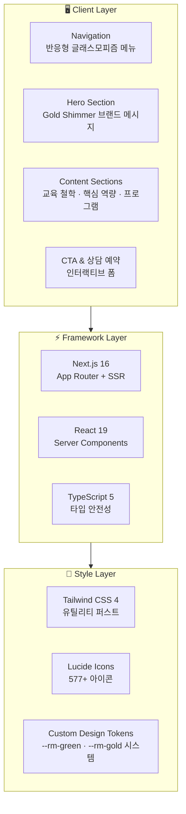

<div align="center">

# 📖 Read Master Academy

**Next.js 16 문해력 학원 프리미엄 브랜드 사이트**

차세대 문해력 교육의 새로운 기준을 제시하는 학원 브랜드 플랫폼

[](https://nextjs.org/)
[](https://react.dev/)
[](https://tailwindcss.com/)
[](https://www.typescriptlang.org/)
[](https://lucide.dev/)
[](LICENSE)

</div>

---

## 🤔 Philosophy — 왜 Read Master Academy인가?

| 기존 학원 사이트 | Read Master Academy |
|:---:|:---:|
| 워드프레스 템플릿 복붙 | **Next.js 16 + React 19 최신 스택** |
| 느린 페이지 로딩 | **서버 컴포넌트 기반 초고속 렌더링** |
| 모바일 깨짐 현상 | **Tailwind CSS 4 완벽 반응형** |
| 무료 아이콘 짜깁기 | **Lucide Icons 통일된 디자인 시스템** |
| 정적 정보 나열 | **인터랙티브 상담 예약 + CTA 플로우** |

> *"문해력은 모든 학습의 뿌리입니다. 브랜드 사이트도 그 깊이를 담아야 합니다."*

---

## 🏗️ Architecture — 시스템 구조



---

## ✨ Features — 기능 레이어

### 🎯 Layer 1 · Brand Experience
| 기능 | 설명 | Wow Moment |
|:---|:---|:---|
| 프리미엄 내비게이션 | 스크롤 반응형 고정 헤더 + 모바일 햄버거 메뉴 | 글래스모피즘 `backdrop-blur` 효과 |
| 히어로 섹션 | 감성적 브랜드 메시지 + 강력한 CTA | Gold shimmer 그라디언트 애니메이션 |
| 디자인 토큰 시스템 | `--rm-green`, `--rm-gold` 20+ CSS 변수 | 학원 BI 즉시 전달 |

### 🧠 Layer 2 · Education Content
| 기능 | 설명 | Wow Moment |
|:---|:---|:---|
| 5대 핵심 역량 | 읽기·쓰기·말하기·사고력·디지털 리터러시 | Brain·Target·Lightbulb 아이콘 매핑 |
| 프로그램 카드 | 단계별 커리큘럼 시각화 + Lucide 아이콘 | GraduationCap 호버 인터랙션 |
| 디지털 리터러시 | 미래형 문해력 교육 소개 | Globe + Sparkles 비주얼 |

### 📞 Layer 3 · Conversion & Contact
| 기능 | 설명 | Wow Moment |
|:---|:---|:---|
| 상담 예약 폼 | 이름·연락처·메시지 인터랙티브 시스템 | Calendar + Send 애니메이션 |
| 개원 안내 | 위치·연락처·운영시간 통합 | MapPin + Phone UI |
| CTA 버튼 시스템 | 다단계 전환 유도 플로우 | ArrowRight 호버 트랜지션 |

---

## 🚀 Quick Start

### 🟢 Starter — 로컬 개발
```bash
git clone https://github.com/Reasonofmoon/read-master-academy.git
cd read-master-academy
npm install
npm run dev
# → http://localhost:3000
```

### 🔵 Pro — 프로덕션 빌드
```bash
# globals.css에서 --rm-green, --rm-gold 색상 커스터마이징
# page.tsx에서 프로그램·교육 콘텐츠 수정
npm run build && npm start
```

### 🟣 Enterprise — Vercel 배포
```bash
npx vercel --prod
# 또는 GitHub 연동 → Push to main = 자동 프로덕션 배포
```

---

## ⚙️ Customization — 커스터마이징 가이드

| 우선순위 | 파일 위치 | 설명 | 난이도 |
|:---|:---|:---|:---:|
| **1st** | `src/app/globals.css` | 색상 토큰 `--rm-green-*`, `--rm-gold-*`, 폰트 | ⭐ |
| **2nd** | `src/app/page.tsx` | 프로그램·교육 콘텐츠·섹션 텍스트 | ⭐⭐ |
| **3rd** | `src/app/layout.tsx` | 메타데이터·SEO·og 태그 | ⭐ |
| **4th** | `lucide-react` import | [lucide.dev](https://lucide.dev)에서 아이콘 선택 | ⭐ |
| **5th** | `src/app/favicon.ico` | 파비콘 이미지 교체 | ⭐ |

---

## 📂 Project Structure

```
read-master-academy/
├── src/
│   └── app/
│       ├── layout.tsx          # 루트 레이아웃 (메타데이터, 폰트)
│       ├── page.tsx            # 메인 랜딩 페이지 (6개 섹션 통합)
│       ├── globals.css         # 디자인 토큰 + 글로벌 스타일
│       └── favicon.ico         # 파비콘
├── public/                     # 정적 에셋
├── ecosystem.json              # 에코시스템 메타데이터
├── next.config.ts              # Next.js 설정
├── tsconfig.json               # TypeScript 설정
├── postcss.config.mjs          # PostCSS + Tailwind 설정
├── eslint.config.mjs           # ESLint 설정
└── package.json                # 의존성 관리
```

---

## 📊 Numbers

| 지표 | 수치 |
|:---|:---|
| **프레임워크** | Next.js 16.1 + React 19.2 |
| **핵심 역량** | 5개 교육 영역 |
| **UI 섹션** | 6개 (Hero ~ 상담 예약) |
| **디자인 토큰** | 20+ CSS 변수 |
| **Lucide 아이콘** | 18종 활용 |
| **반응형** | Mobile / Tablet / Desktop |

---

## 📋 Requirements

| 도구 | 버전 |
|:---|:---|
| Node.js | 20+ |
| npm | 9+ |
| Next.js | 16.1 |
| React | 19.2 |

---

## 🤝 Contributing

1. Fork this repository
2. Create your feature branch (`git checkout -b feature/amazing-feature`)
3. Commit your changes (`git commit -m 'feat: add amazing feature'`)
4. Push to the branch (`git push origin feature/amazing-feature`)
5. Open a Pull Request

컨벤션: **Conventional Commits** 사용

---

## 📄 License

This project is licensed under the **MIT License** — see the [LICENSE](LICENSE) file for details.

---

<div align="center">

**Read Master Academy** · 문해력이 미래를 바꾼다

Made by [Reason of Moon](https://github.com/Reasonofmoon)

</div>
