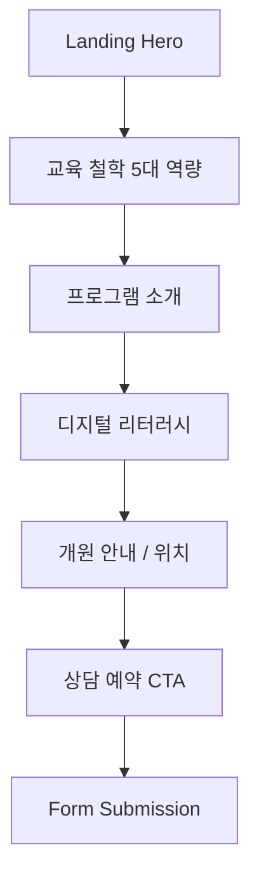

<div align="center">

# Read Master Academy

### *문해력이 미래를 바꾼다*

**AI 기반 문해력 전문 교육원 브랜드 사이트**

[](https://nextjs.org)
[](https://react.dev)
[](https://tailwindcss.com)
[](https://www.typescriptlang.org)
[](LICENSE)

> **"읽기 능력은 모든 학습의 출발점입니다"**
> 문해력 교육 전문 아카데미의 철학과 프로그램을 소개하는 브랜드 웹사이트

</div>

---

## 🧠 Philosophy

| 기준 | 일반 학원 사이트 | Read Master Academy |
|------|-----------------|---------------------|
| 교육 철학 | 성적 위주 광고 | **5대 핵심 역량 기반 체계적 접근** |
| 프로그램 안내 | 텍스트 나열 | **인터랙티브 섹션 + 아이콘 시각화** |
| 상담 전환 | 전화번호만 표시 | **온라인 예약 폼 + CTA 최적화** |
| 디자인 | 템플릿 사이트 | **커스텀 디자인 시스템 (Gold+Green)** |
| 성능 | CSR 느린 로딩 | **Next.js 16 SSR + 최적화** |



## ⚙️ System Layers

### Layer 1 · Brand Experience
| 기능 | 설명 |
|------|------|
| Hero Section | Gold shimmer 효과 + 핵심 메시지 |
| Navigation | 반응형 모바일 햄버거 + 섹션 스크롤 |
| Color System | `--rm-green`, `--rm-gold` CSS 변수 체계 |

> **Wow**: 골드 + 그린 디자인 토큰으로 학원 브랜드 아이덴티티를 **즉시** 전달

### Layer 2 · Education Content
| 기능 | 설명 |
|------|------|
| 5대 핵심 역량 | 읽기/쓰기/말하기/사고력/디지털 리터러시 |
| 프로그램 카드 | Lucide 아이콘 + 호버 인터랙션 |
| 상담 예약 폼 | 이름/연락처/메시지 + 전송 기능 |

### Layer 3 · Technical Foundation
| 기능 | 설명 |
|------|------|
| Next.js 16 | App Router + Server Components |
| React 19 | 최신 렌더링 최적화 |
| Tailwind CSS 4 | 유틸리티 기반 스타일링 |

## 🎯 Getting Started

### 🟢 Starter
```bash
git clone https://github.com/Reasonofmoon/read-master-academy.git
cd read-master-academy
npm install && npm run dev
```

### 🔵 Professional
```bash
# 브랜드 커스터마이징
# src/app/globals.css에서 --rm-green, --rm-gold 색상 변경
# src/app/page.tsx에서 프로그램 내용 수정
npm run build && npm start
```

### 🟣 Enterprise
```bash
# Vercel 배포
vercel deploy --prod
```

## 🔧 Customization

| 우선순위 | 파일 | 내용 | 난이도 |
|----------|------|------|--------|
| **1st** | `globals.css` | 색상 토큰, 폰트 | ⭐ |
| **2nd** | `page.tsx` | 프로그램/교육 콘텐츠 | ⭐⭐ |
| **3rd** | `layout.tsx` | 메타데이터, SEO | ⭐ |

## 📁 Project Structure

```
read-master-academy/
├── src/app/
│   ├── page.tsx          # 메인 랜딩 페이지 (전체 콘텐츠)
│   ├── layout.tsx        # 루트 레이아웃 + 메타데이터
│   ├── globals.css       # 디자인 토큰 + 글로벌 스타일
│   └── favicon.ico
├── package.json          # Next.js 16.1 + React 19.2
├── tailwind.config.ts
└── tsconfig.json
```

## 📊 Numbers

| 항목 | 수치 |
|------|------|
| 핵심 역량 | 5개 |
| 섹션 | 6개 (Hero~상담) |
| 디자인 토큰 | 20+ CSS 변수 |
| 프레임워크 | Next.js 16 + React 19 |

## 📋 Requirements

| 항목 | 버전 |
|------|------|
| Node.js | 20+ |
| npm | 9+ |
| Next.js | 16.1 |
| React | 19.2 |

## 🌐 i18n

| 항목 | 현황 |
|------|------|
| UI | 한국어 |
| 확장 계획 | 영어 지원 예정 |

## 🤝 Contributing

1. Fork → Branch → PR
2. 컨벤션: Conventional Commits

## 📄 License

MIT License

<div align="center">
<br>

**Read Master Academy** · 문해력이 미래를 바꾼다

Made by [Reason of Moon](https://github.com/Reasonofmoon)

</div>
